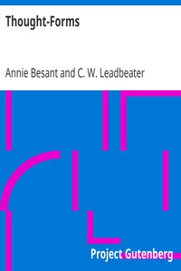

# Thought-Forms <kbd>v2.2.1</kbd>

## Authors

 - Besant, Annie <small>(1847 - 1933)</small>
 - Leadbeater, C. W. (Charles Webster) <small>(1854 - 1934)</small>

## Translators

## Subjects

 - Theosophy
 - Thought and thinking

## Readablility

 - **A1:** 70%
 - **A2:** 77%
 - **B1:** 85%
 - **B2:** 91%
 - **C1:** 96%
 - **C2:** 100%

## Words Count

 - **A1:** 428
 - **A2:** 309
 - **B1:** 518
 - **B2:** 645
 - **C1:** 633
 - **C2:** 343

## Source

<kbd>GUTHENBURGE:16269</kbd>
