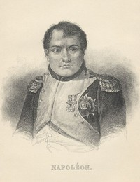

# Memoirs of Napoleon Bonaparte — Complete <kbd>v2.3.0</kbd>

## Authors

 - Bourrienne, Louis Antoine Fauvelet de <small>(1769 - 1834)</small>

## Translators

## Subjects

 - Bourrienne, Louis Antoine Fauvelet de, 1769-1834
 - Napoleon I, Emperor of the French, 1769-1821
 - Napoleon I, Emperor of the French, 1769-1821
 - Napoleon I, Emperor of the French, 1769-1821
 - Private secretaries

## Readablility

 - **A1:** 76%
 - **A2:** 82%
 - **B1:** 88%
 - **B2:** 94%
 - **C1:** 98%
 - **C2:** 100%

## Words Count

 - **A1:** 494
 - **A2:** 492
 - **B1:** 980
 - **B2:** 1818
 - **C1:** 2839
 - **C2:** 2585

## Source

<kbd>GUTHENBURGE:3567</kbd>
