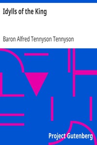

# Idylls of the King <kbd>v2.2.1</kbd>

## Authors

 - Tennyson, Alfred Tennyson, Baron <small>(1809 - 1892)</small>

## Translators

## Subjects

 - Arthur, King
 - Arthurian romances
 - Knights and knighthood

## Readablility

 - **A1:** 75%
 - **A2:** 81%
 - **B1:** 87%
 - **B2:** 93%
 - **C1:** 98%
 - **C2:** 100%

## Words Count

 - **A1:** 481
 - **A2:** 410
 - **B1:** 672
 - **B2:** 1002
 - **C1:** 1243
 - **C2:** 933

## Source

<kbd>GUTHENBURGE:610</kbd>
