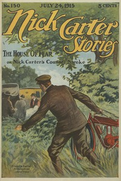

# Nick Carter Stories No. 150, July 24, 1915: The House of Fear; or, Nick Carter's Counterstroke. <kbd>v2.2.1</kbd>

## Authors

 - Carter, Nicholas (House name) <small>(-1 - -1)</small>
 - Boston, Ralph <small>(-1 - -1)</small>

## Translators

## Subjects

 - Detective and mystery stories, American
 - Popular literature

## Readablility

 - **A1:** 74%
 - **A2:** 80%
 - **B1:** 86%
 - **B2:** 92%
 - **C1:** 97%
 - **C2:** 100%

## Words Count

 - **A1:** 480
 - **A2:** 424
 - **B1:** 700
 - **B2:** 925
 - **C1:** 941
 - **C2:** 498

## Source

<kbd>GUTHENBURGE:68116</kbd>
