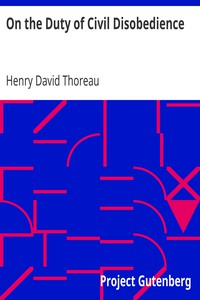

# On the Duty of Civil Disobedience <kbd>v2.0.2</kbd>

## Authors

 - Thoreau, Henry David <small>(1817 - 1862)</small>

## Translators

## Subjects

 - Civil disobedience
 - Government, Resistance to

## Readablility

 - **A1:** 52%
 - **A2:** 60%
 - **B1:** 72%
 - **B2:** 88%
 - **C1:** 91%
 - **C2:** 100%

## Words Count

 - **A1:** 386
 - **A2:** 278
 - **B1:** 406
 - **B2:** 531
 - **C1:** 173
 - **C2:** 633

## Source

<kbd>GUTHENBURGE:71</kbd>
