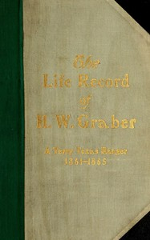

# The life record of H. W. Graber: A Terry Texas Ranger, 1861-1865; sixty-two years in Texas <kbd>v2.2.1</kbd>

## Authors

 - Graber, H. W. (Henry W.) <small>(1841 - 1917)</small>

## Translators

## Subjects

 - Graber, H. W. (Henry W.), 1841-1917
 - Texas
 - Texas
 - Texas
 - Texas Rangers
 - United States

## Readablility

 - **A1:** 75%
 - **A2:** 82%
 - **B1:** 88%
 - **B2:** 95%
 - **C1:** 98%
 - **C2:** 100%

## Words Count

 - **A1:** 481
 - **A2:** 468
 - **B1:** 792
 - **B2:** 1181
 - **C1:** 1282
 - **C2:** 752

## Source

<kbd>GUTHENBURGE:68143</kbd>
