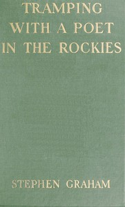

# Tramping With a Poet in the Rockies <kbd>v2.2.1</kbd>

## Authors

 - Lindsay, Vachel <small>(1879 - 1931)</small>
 - Graham, Stephen <small>(1884 - 1975)</small>

## Translators

## Subjects

 - Lindsay, Vachel, 1879-1931
 - Rocky Mountains
 - West (U.S.)

## Readablility

 - **A1:** 75%
 - **A2:** 81%
 - **B1:** 87%
 - **B2:** 93%
 - **C1:** 97%
 - **C2:** 100%

## Words Count

 - **A1:** 492
 - **A2:** 449
 - **B1:** 761
 - **B2:** 1052
 - **C1:** 1160
 - **C2:** 785

## Source

<kbd>GUTHENBURGE:67960</kbd>
