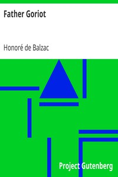

# Father Goriot <kbd>v2.2.1</kbd>

## Authors

 - Balzac, Honoré de <small>(1799 - 1850)</small>

## Translators

 - Marriage, Ellen <small>(1865 - 1946)</small>

## Subjects

 - Fathers and daughters
 - France
 - French fiction
 - Older men
 - Paris (France)

## Readablility

 - **A1:** 79%
 - **A2:** 84%
 - **B1:** 89%
 - **B2:** 94%
 - **C1:** 98%
 - **C2:** 100%

## Words Count

 - **A1:** 493
 - **A2:** 482
 - **B1:** 904
 - **B2:** 1499
 - **C1:** 1764
 - **C2:** 1229

## Source

<kbd>GUTHENBURGE:1237</kbd>
