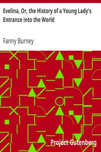

# Evelina, Or, the History of a Young Lady's Entrance into the World <kbd>v2.2.1</kbd>

## Authors

 - Burney, Fanny <small>(1752 - 1840)</small>

## Translators

## Subjects

 - Bildungsromans
 - Debutantes
 - Epistolary fiction
 - Humorous stories
 - London (England)
 - Love stories
 - Satire
 - Socialites
 - Young women

## Readablility

 - **A1:** 78%
 - **A2:** 84%
 - **B1:** 89%
 - **B2:** 94%
 - **C1:** 98%
 - **C2:** 100%

## Words Count

 - **A1:** 491
 - **A2:** 470
 - **B1:** 829
 - **B2:** 1322
 - **C1:** 1655
 - **C2:** 1029

## Source

<kbd>GUTHENBURGE:6053</kbd>
