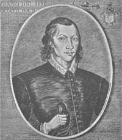

# The Poems of John Donne, Volume 1 (of 2): Edited from the Old Editions and Numerous Manuscripts <kbd>v2.2.1</kbd>

## Authors

 - Donne, John <small>(1572 - 1631)</small>

## Translators

## Subjects

 - English poetry

## Readablility

 - **A1:** 81%
 - **A2:** 85%
 - **B1:** 89%
 - **B2:** 94%
 - **C1:** 98%
 - **C2:** 100%

## Words Count

 - **A1:** 478
 - **A2:** 432
 - **B1:** 760
 - **B2:** 1170
 - **C1:** 1447
 - **C2:** 1114

## Source

<kbd>GUTHENBURGE:48688</kbd>
