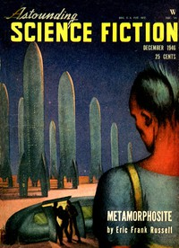

# The Impossible Pirate <kbd>v2.3.0</kbd>

## Authors

 - Smith, George O. (George Oliver) <small>(1911 - 1981)</small>

## Translators

## Subjects

 - Pirates
 - Police
 - Science fiction
 - Short stories

## Readablility

 - **A1:** 70%
 - **A2:** 77%
 - **B1:** 85%
 - **B2:** 92%
 - **C1:** 98%
 - **C2:** 100%

## Words Count

 - **A1:** 378
 - **A2:** 228
 - **B1:** 290
 - **B2:** 336
 - **C1:** 258
 - **C2:** 117

## Source

<kbd>GUTHENBURGE:68230</kbd>
