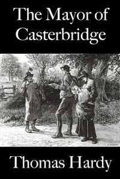

# The Mayor of Casterbridge <kbd>v2.3.0</kbd>

## Authors

 - Hardy, Thomas <small>(1840 - 1928)</small>

## Translators

## Subjects

 - Atonement
 - Fathers and daughters
 - Mayors
 - Men
 - Psychological fiction
 - Runaway husbands
 - Wessex (England)

## Readablility

 - **A1:** 78%
 - **A2:** 84%
 - **B1:** 89%
 - **B2:** 94%
 - **C1:** 98%
 - **C2:** 100%

## Words Count

 - **A1:** 493
 - **A2:** 484
 - **B1:** 910
 - **B2:** 1557
 - **C1:** 1946
 - **C2:** 1492

## Source

<kbd>GUTHENBURGE:143</kbd>
