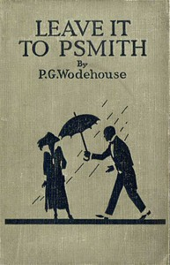

# Leave it to Psmith <kbd>v2.3.0</kbd>

## Authors

 - Wodehouse, P. G. (Pelham Grenville) <small>(1881 - 1975)</small>

## Translators

## Subjects

 - Blandings Castle (England : Imaginary place)
 - Humorous stories
 - Impostors and imposture
 - Jewel thieves
 - Nobility
 - Shropshire (England)

## Readablility

 - **A1:** 77%
 - **A2:** 82%
 - **B1:** 87%
 - **B2:** 93%
 - **C1:** 98%
 - **C2:** 100%

## Words Count

 - **A1:** 491
 - **A2:** 470
 - **B1:** 865
 - **B2:** 1404
 - **C1:** 1649
 - **C2:** 1149

## Source

<kbd>GUTHENBURGE:60067</kbd>
