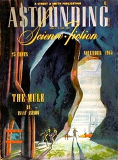

# Identity <kbd>v2.2.1</kbd>

## Authors

 - Smith, George O. (George Oliver) <small>(1911 - 1981)</small>

## Translators

## Subjects

 - Identity
 - Man-woman relationships
 - Science fiction
 - Treasure troves
 - Twins

## Readablility

 - **A1:** 74%
 - **A2:** 80%
 - **B1:** 85%
 - **B2:** 91%
 - **C1:** 96%
 - **C2:** 100%

## Words Count

 - **A1:** 437
 - **A2:** 310
 - **B1:** 426
 - **B2:** 533
 - **C1:** 446
 - **C2:** 286

## Source

<kbd>GUTHENBURGE:68002</kbd>
