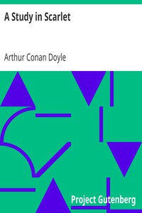

# A Study in Scarlet <kbd>v2.0.7</kbd>

## Authors

 - Doyle, Arthur Conan <small>(1859 - 1930)</small>

## Translators

## Subjects

 - Detective and mystery stories
 - England
 - Holmes, Sherlock (Fictitious character)
 - Private investigators

## Readablility

 - **A1:** 70%
 - **A2:** 76%
 - **B1:** 82%
 - **B2:** 87%
 - **C1:** 89%
 - **C2:** 100%

## Words Count

 - **A1:** 771
 - **A2:** 561
 - **B1:** 785
 - **B2:** 971
 - **C1:** 329
 - **C2:** 2707

## Source

<kbd>GUTHENBURGE:244</kbd>
