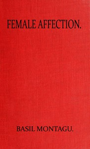

# Female affection <kbd>v2.3.0</kbd>

## Authors

 - Montagu, Basil <small>(1770 - 1851)</small>

## Translators

## Subjects

 - Affect (Psychology)
 - Emotions

## Readablility

 - **A1:** 74%
 - **A2:** 80%
 - **B1:** 87%
 - **B2:** 94%
 - **C1:** 99%
 - **C2:** 100%

## Words Count

 - **A1:** 455
 - **A2:** 306
 - **B1:** 449
 - **B2:** 597
 - **C1:** 437
 - **C2:** 158

## Source

<kbd>GUTHENBURGE:68068</kbd>
