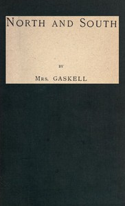

# North and South <kbd>v2.3.0</kbd>

## Authors

 - Gaskell, Elizabeth Cleghorn <small>(1810 - 1865)</small>

## Translators

## Subjects

 - Bildungsromans
 - Children of clergy
 - Didactic fiction
 - England, Northern
 - Mothers and daughters
 - Social classes
 - Young women

## Readablility

 - **A1:** 80%
 - **A2:** 85%
 - **B1:** 90%
 - **B2:** 95%
 - **C1:** 98%
 - **C2:** 100%

## Words Count

 - **A1:** 494
 - **A2:** 492
 - **B1:** 943
 - **B2:** 1594
 - **C1:** 2144
 - **C2:** 1433

## Source

<kbd>GUTHENBURGE:4276</kbd>
