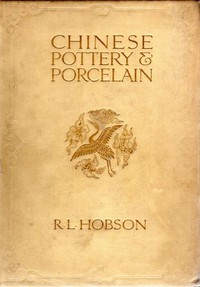

# Chinese Pottery and Porcelain: Vol. 1. Pottery and Early Wares <kbd>v2.2.1</kbd>

## Authors

 - Hobson, R. L. (Robert Lockhart) <small>(1872 - 1941)</small>

## Translators

## Subjects

 - Porcelain, Chinese
 - Pottery, Chinese

## Readablility

 - **A1:** 70%
 - **A2:** 76%
 - **B1:** 82%
 - **B2:** 88%
 - **C1:** 93%
 - **C2:** 99%

## Words Count

 - **A1:** 468
 - **A2:** 401
 - **B1:** 704
 - **B2:** 1035
 - **C1:** 1263
 - **C2:** 904

## Source

<kbd>GUTHENBURGE:67970</kbd>
