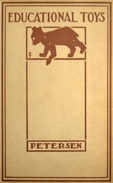

# Educational Toys: Consisting Chiefly of Coping-Saw Problems for Children in School and the Home <kbd>v2.3.0</kbd>

## Authors

 - Petersen, Louis Christian <small>(1878 - -1)</small>

## Translators

## Subjects

 - Toys
 - Woodwork

## Readablility

 - **A1:** 66%
 - **A2:** 73%
 - **B1:** 82%
 - **B2:** 89%
 - **C1:** 97%
 - **C2:** 100%

## Words Count

 - **A1:** 367
 - **A2:** 244
 - **B1:** 361
 - **B2:** 444
 - **C1:** 401
 - **C2:** 238

## Source

<kbd>GUTHENBURGE:43635</kbd>
