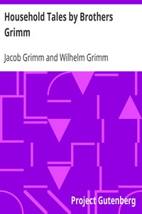

# Household Tales by Brothers Grimm <kbd>v2.0.2</kbd>

## Authors

 - Grimm, Wilhelm <small>(1786 - 1859)</small>
 - Grimm, Jacob <small>(1785 - 1863)</small>

## Translators

 - Hunt, Alfred William, Mrs. <small>(1831 - 1912)</small>

## Subjects

 - Fairy tales

## Readablility

 - **A1:** 58%
 - **A2:** 66%
 - **B1:** 76%
 - **B2:** 88%
 - **C1:** 92%
 - **C2:** 100%

## Words Count

 - **A1:** 575
 - **A2:** 495
 - **B1:** 891
 - **B2:** 1422
 - **C1:** 632
 - **C2:** 4066

## Source

<kbd>GUTHENBURGE:5314</kbd>
