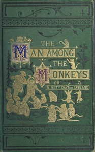

# The man among the monkeys; or, Ninety days in apeland: To which are added: The philosopher and his monkeys, The professor and the crocodile, and other strange stories of men and animals <kbd>v2.2.1</kbd>

## Authors

 - Gozlan, Léon <small>(1803 - 1866)</small>

## Translators

## Subjects

 - Human-animal relationships
 - Monkeys
 - Robinsonades
 - Shipwreck survival
 - Survival

## Readablility

 - **A1:** 73%
 - **A2:** 79%
 - **B1:** 85%
 - **B2:** 92%
 - **C1:** 97%
 - **C2:** 100%

## Words Count

 - **A1:** 493
 - **A2:** 486
 - **B1:** 927
 - **B2:** 1604
 - **C1:** 2120
 - **C2:** 1413

## Source

<kbd>GUTHENBURGE:68059</kbd>
