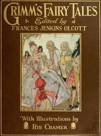

# Grimm's Fairy Tales <kbd>v2.3.0</kbd>

## Authors

 - Grimm, Wilhelm <small>(1786 - 1859)</small>
 - Grimm, Jacob <small>(1785 - 1863)</small>

## Translators

## Subjects

 - Children's stories, German
 - Fairy tales
 - Fairy tales

## Readablility

 - **A1:** 79%
 - **A2:** 85%
 - **B1:** 90%
 - **B2:** 95%
 - **C1:** 99%
 - **C2:** 100%

## Words Count

 - **A1:** 484
 - **A2:** 422
 - **B1:** 725
 - **B2:** 980
 - **C1:** 966
 - **C2:** 473

## Source

<kbd>GUTHENBURGE:52521</kbd>
