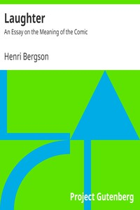

# Laughter: An Essay on the Meaning of the Comic <kbd>v2.3.0</kbd>

## Authors

 - Bergson, Henri <small>(1859 - 1941)</small>

## Translators

 - Rothwell, Fred <small>(1869 - 1934)</small>
 - Brereton, Cloudesley <small>(1863 - 1937)</small>

## Subjects

 - Comedy
 - Laughter
 - Philosophy, French

## Readablility

 - **A1:** 73%
 - **A2:** 79%
 - **B1:** 85%
 - **B2:** 91%
 - **C1:** 97%
 - **C2:** 100%

## Words Count

 - **A1:** 462
 - **A2:** 392
 - **B1:** 622
 - **B2:** 878
 - **C1:** 972
 - **C2:** 660

## Source

<kbd>GUTHENBURGE:4352</kbd>
