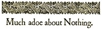

# Much Ado about Nothing <kbd>v2.3.0</kbd>

## Authors

 - Shakespeare, William <small>(1564 - 1616)</small>

## Translators

## Subjects

 - Comedies
 - Conspiracies
 - Courtship
 - Messina (Italy)
 - Rejection (Psychology)

## Readablility

 - **A1:** 76%
 - **A2:** 82%
 - **B1:** 88%
 - **B2:** 94%
 - **C1:** 98%
 - **C2:** 100%

## Words Count

 - **A1:** 452
 - **A2:** 321
 - **B1:** 472
 - **B2:** 622
 - **C1:** 517
 - **C2:** 286

## Source

<kbd>GUTHENBURGE:1519</kbd>
