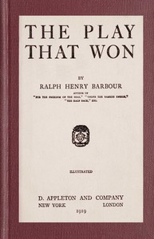

# The play that won <kbd>v2.2.1</kbd>

## Authors

 - Barbour, Ralph Henry <small>(1870 - 1944)</small>

## Translators

## Subjects

 - Short stories, American
 - Sports

## Readablility

 - **A1:** 75%
 - **A2:** 82%
 - **B1:** 88%
 - **B2:** 93%
 - **C1:** 98%
 - **C2:** 100%

## Words Count

 - **A1:** 476
 - **A2:** 426
 - **B1:** 720
 - **B2:** 949
 - **C1:** 964
 - **C2:** 600

## Source

<kbd>GUTHENBURGE:68062</kbd>
