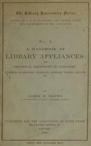

# A handbook of library appliances: The technical equipment of libraries: fittings, furniture, charging systems, forms, recipes, etc. <kbd>v2.2.1</kbd>

## Authors

 - Brown, James Duff <small>(1862 - 1914)</small>

## Translators

## Subjects

 - Library fittings and supplies

## Readablility

 - **A1:** 67%
 - **A2:** 74%
 - **B1:** 82%
 - **B2:** 90%
 - **C1:** 96%
 - **C2:** 99%

## Words Count

 - **A1:** 405
 - **A2:** 296
 - **B1:** 415
 - **B2:** 543
 - **C1:** 524
 - **C2:** 267

## Source

<kbd>GUTHENBURGE:68130</kbd>
