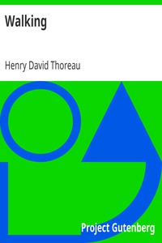

# Walking <kbd>v2.3.0</kbd>

## Authors

 - Thoreau, Henry David <small>(1817 - 1862)</small>

## Translators

## Subjects

 - Essays
 - Nature
 - Walking

## Readablility

 - **A1:** 73%
 - **A2:** 80%
 - **B1:** 86%
 - **B2:** 93%
 - **C1:** 98%
 - **C2:** 100%

## Words Count

 - **A1:** 446
 - **A2:** 313
 - **B1:** 462
 - **B2:** 567
 - **C1:** 515
 - **C2:** 247

## Source

<kbd>GUTHENBURGE:1022</kbd>
