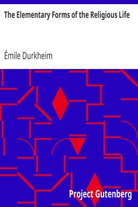

# The Elementary Forms of the Religious Life <kbd>v2.2.1</kbd>

## Authors

 - Durkheim, Émile <small>(1858 - 1917)</small>

## Translators

 - Swain, Joseph Ward <small>(1891 - -1)</small>

## Subjects

 - Cults
 - Religion
 - Religion
 - Rites and ceremonies
 - Totemism

## Readablility

 - **A1:** 75%
 - **A2:** 81%
 - **B1:** 87%
 - **B2:** 92%
 - **C1:** 97%
 - **C2:** 100%

## Words Count

 - **A1:** 481
 - **A2:** 444
 - **B1:** 821
 - **B2:** 1253
 - **C1:** 1589
 - **C2:** 1343

## Source

<kbd>GUTHENBURGE:41360</kbd>
