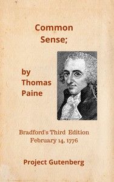

# Common Sense <kbd>v2.3.0</kbd>

## Authors

 - Paine, Thomas <small>(1737 - 1809)</small>

## Translators

## Subjects

 - Monarchy
 - Political science
 - United States

## Readablility

 - **A1:** 74%
 - **A2:** 80%
 - **B1:** 87%
 - **B2:** 93%
 - **C1:** 98%
 - **C2:** 100%

## Words Count

 - **A1:** 449
 - **A2:** 337
 - **B1:** 545
 - **B2:** 711
 - **C1:** 681
 - **C2:** 320

## Source

<kbd>GUTHENBURGE:147</kbd>
