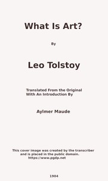

# What Is Art? <kbd>v2.3.0</kbd>

## Authors

 - Tolstoy, Leo, graf <small>(1828 - 1910)</small>

## Translators

 - Maude, Aylmer <small>(1858 - 1938)</small>

## Subjects

 - Arts
 - Arts and morals

## Readablility

 - **A1:** 74%
 - **A2:** 80%
 - **B1:** 86%
 - **B2:** 93%
 - **C1:** 97%
 - **C2:** 100%

## Words Count

 - **A1:** 490
 - **A2:** 445
 - **B1:** 759
 - **B2:** 1180
 - **C1:** 1353
 - **C2:** 870

## Source

<kbd>GUTHENBURGE:64908</kbd>
