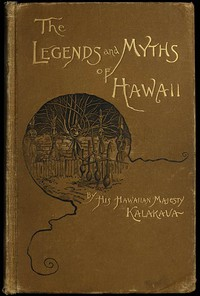

# The Legends and Myths of Hawaii: The fables and folk-lore of a strange people <kbd>v2.2.1</kbd>

## Authors

 - Kalakaua, David, King of Hawaii <small>(1836 - 1891)</small>

## Translators

## Subjects

 - Legends

## Readablility

 - **A1:** 74%
 - **A2:** 79%
 - **B1:** 87%
 - **B2:** 93%
 - **C1:** 98%
 - **C2:** 100%

## Words Count

 - **A1:** 485
 - **A2:** 469
 - **B1:** 908
 - **B2:** 1575
 - **C1:** 2140
 - **C2:** 1473

## Source

<kbd>GUTHENBURGE:56597</kbd>
