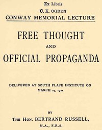

# Free Thought and Official Propaganda <kbd>v2.3.0</kbd>

## Authors

 - Russell, Bertrand <small>(1872 - 1970)</small>

## Translators

## Subjects

 - Free thought
 - Liberalism
 - Propaganda

## Readablility

 - **A1:** 71%
 - **A2:** 78%
 - **B1:** 86%
 - **B2:** 93%
 - **C1:** 98%
 - **C2:** 100%

## Words Count

 - **A1:** 377
 - **A2:** 236
 - **B1:** 350
 - **B2:** 420
 - **C1:** 327
 - **C2:** 163

## Source

<kbd>GUTHENBURGE:44932</kbd>
