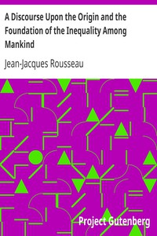

# A Discourse Upon the Origin and the Foundation of the Inequality Among Mankind <kbd>v2.3.0</kbd>

## Authors

 - Rousseau, Jean-Jacques <small>(1712 - 1778)</small>

## Translators

## Subjects

 - Equality
 - Natural law
 - Political science

## Readablility

 - **A1:** 74%
 - **A2:** 80%
 - **B1:** 87%
 - **B2:** 93%
 - **C1:** 98%
 - **C2:** 100%

## Words Count

 - **A1:** 446
 - **A2:** 358
 - **B1:** 581
 - **B2:** 809
 - **C1:** 738
 - **C2:** 385

## Source

<kbd>GUTHENBURGE:11136</kbd>
