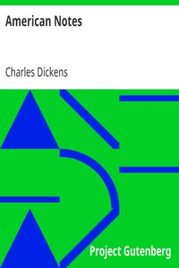

# American Notes <kbd>v2.2.1</kbd>

## Authors

 - Dickens, Charles <small>(1812 - 1870)</small>

## Translators

## Subjects

 - Dickens, Charles, 1812-1870
 - United States
 - United States

## Readablility

 - **A1:** 74%
 - **A2:** 80%
 - **B1:** 86%
 - **B2:** 93%
 - **C1:** 98%
 - **C2:** 100%

## Words Count

 - **A1:** 492
 - **A2:** 493
 - **B1:** 953
 - **B2:** 1662
 - **C1:** 2210
 - **C2:** 1489

## Source

<kbd>GUTHENBURGE:675</kbd>
