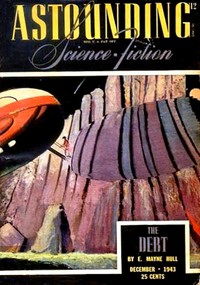

# Lost Art <kbd>v2.3.0</kbd>

## Authors

 - Smith, George O. (George Oliver) <small>(1911 - 1981)</small>

## Translators

## Subjects

 - Electrical engineers
 - Mars (Planet)
 - Martians
 - Science fiction

## Readablility

 - **A1:** 74%
 - **A2:** 80%
 - **B1:** 86%
 - **B2:** 92%
 - **C1:** 97%
 - **C2:** 100%

## Words Count

 - **A1:** 411
 - **A2:** 250
 - **B1:** 333
 - **B2:** 397
 - **C1:** 307
 - **C2:** 193

## Source

<kbd>GUTHENBURGE:67923</kbd>
