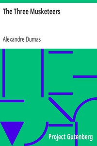

# The Three Musketeers <kbd>v2.3.0</kbd>

## Authors

 - Dumas, Alexandre <small>(1802 - 1870)</small>

## Translators

## Subjects

 - Adventure and adventurers
 - France
 - Historical fiction
 - Swordsmen

## Readablility

 - **A1:** 79%
 - **A2:** 84%
 - **B1:** 90%
 - **B2:** 95%
 - **C1:** 98%
 - **C2:** 100%

## Words Count

 - **A1:** 493
 - **A2:** 491
 - **B1:** 944
 - **B2:** 1644
 - **C1:** 2168
 - **C2:** 1503

## Source

<kbd>GUTHENBURGE:1257</kbd>
