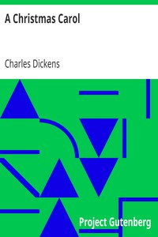

# A Christmas Carol <kbd>v2.2.1</kbd>

## Authors

 - Dickens, Charles <small>(1812 - 1870)</small>

## Translators

## Subjects

 - Christmas stories
 - Ghost stories
 - London (England)
 - Misers
 - Poor families
 - Scrooge, Ebenezer (Fictitious character)
 - Sick children

## Readablility

 - **A1:** 76%
 - **A2:** 82%
 - **B1:** 88%
 - **B2:** 93%
 - **C1:** 98%
 - **C2:** 100%

## Words Count

 - **A1:** 486
 - **A2:** 432
 - **B1:** 660
 - **B2:** 835
 - **C1:** 866
 - **C2:** 493

## Source

<kbd>GUTHENBURGE:24022</kbd>
