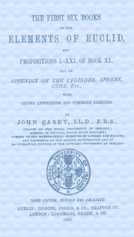

# The First Six Books of the Elements of Euclid <kbd>v2.2.1</kbd>

## Authors

 - Euclid <small>(-1 - -1)</small>
 - Casey, John <small>(1820 - 1891)</small>

## Translators

## Subjects

 - Euclid's Elements
 - Mathematics, Greek

## Readablility

 - **A1:** 76%
 - **A2:** 81%
 - **B1:** 87%
 - **B2:** 90%
 - **C1:** 95%
 - **C2:** 99%

## Words Count

 - **A1:** 361
 - **A2:** 219
 - **B1:** 336
 - **B2:** 415
 - **C1:** 375
 - **C2:** 262

## Source

<kbd>GUTHENBURGE:21076</kbd>
