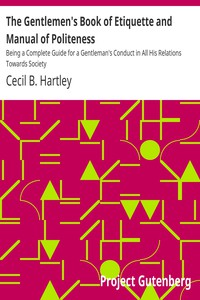

# The Gentlemen's Book of Etiquette and Manual of Politeness: Being a Complete Guide for a Gentleman's Conduct in All His Relations Towards Society <kbd>v2.2.1</kbd>

## Authors

 - Hartley, Cecil B. <small>(-1 - -1)</small>

## Translators

## Subjects

 - Etiquette
 - Etiquette for men
 - Men

## Readablility

 - **A1:** 74%
 - **A2:** 81%
 - **B1:** 87%
 - **B2:** 93%
 - **C1:** 98%
 - **C2:** 100%

## Words Count

 - **A1:** 493
 - **A2:** 478
 - **B1:** 897
 - **B2:** 1401
 - **C1:** 1749
 - **C2:** 1132

## Source

<kbd>GUTHENBURGE:39293</kbd>
