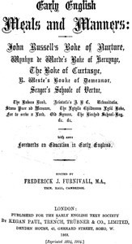

# Early English Meals and Manners <kbd>v2.2.1</kbd>

## Authors

## Translators

## Subjects

 - Education
 - England
 - Etiquette
 - Home economics
 - Table

## Readablility

 - **A1:** 80%
 - **A2:** 84%
 - **B1:** 88%
 - **B2:** 92%
 - **C1:** 96%
 - **C2:** 100%

## Words Count

 - **A1:** 491
 - **A2:** 465
 - **B1:** 844
 - **B2:** 1268
 - **C1:** 1629
 - **C2:** 1467

## Source

<kbd>GUTHENBURGE:24790</kbd>
