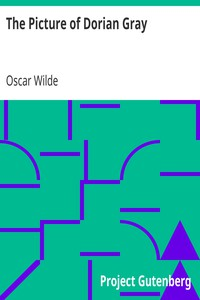

# The Picture of Dorian Gray <kbd>v2.2.1</kbd>

## Authors

 - Wilde, Oscar <small>(1854 - 1900)</small>

## Translators

## Subjects

 - Appearance (Philosophy)
 - Conduct of life
 - Didactic fiction
 - Great Britain
 - London (England)
 - Paranormal fiction
 - Portraits
 - Supernatural

## Readablility

 - **A1:** 78%
 - **A2:** 84%
 - **B1:** 89%
 - **B2:** 94%
 - **C1:** 98%
 - **C2:** 100%

## Words Count

 - **A1:** 485
 - **A2:** 458
 - **B1:** 730
 - **B2:** 997
 - **C1:** 1006
 - **C2:** 596

## Source

<kbd>GUTHENBURGE:4078</kbd>
