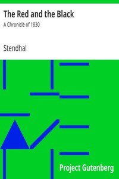

# The Red and the Black: A Chronicle of 1830 <kbd>v2.2.1</kbd>

## Authors

 - Stendhal <small>(1783 - 1842)</small>

## Translators

 - Samuel, Horace Barnett <small>(1883 - 1950)</small>

## Subjects

 - Ambition
 - Bildungsromans
 - Church and state
 - France
 - Young men

## Readablility

 - **A1:** 77%
 - **A2:** 83%
 - **B1:** 89%
 - **B2:** 94%
 - **C1:** 98%
 - **C2:** 100%

## Words Count

 - **A1:** 493
 - **A2:** 487
 - **B1:** 937
 - **B2:** 1605
 - **C1:** 2175
 - **C2:** 1564

## Source

<kbd>GUTHENBURGE:44747</kbd>
