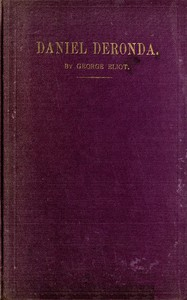

# Daniel Deronda <kbd>v2.2.1</kbd>

## Authors

 - Eliot, George <small>(1819 - 1880)</small>

## Translators

## Subjects

 - Didactic fiction
 - England
 - Jewish fiction
 - Jews
 - Zionists

## Readablility

 - **A1:** 78%
 - **A2:** 84%
 - **B1:** 89%
 - **B2:** 94%
 - **C1:** 98%
 - **C2:** 100%

## Words Count

 - **A1:** 494
 - **A2:** 493
 - **B1:** 966
 - **B2:** 1833
 - **C1:** 2853
 - **C2:** 2483

## Source

<kbd>GUTHENBURGE:7469</kbd>
