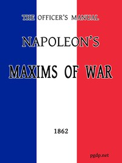

# The Officer's Manual: Napoleon's Maxims of War <kbd>v2.2.1</kbd>

## Authors

 - Napoleon I, Emperor of the French <small>(1769 - 1821)</small>

## Translators

 - D'Aguilar, G. C. (George Charles), Sir <small>(1784 - 1855)</small>

## Subjects

 - Military art and science
 - Military art and science
 - Napoleon I, Emperor of the French, 1769-1821
 - Napoleon I, Emperor of the French, 1769-1821

## Readablility

 - **A1:** 71%
 - **A2:** 79%
 - **B1:** 86%
 - **B2:** 93%
 - **C1:** 98%
 - **C2:** 100%

## Words Count

 - **A1:** 427
 - **A2:** 325
 - **B1:** 495
 - **B2:** 666
 - **C1:** 610
 - **C2:** 264

## Source

<kbd>GUTHENBURGE:50750</kbd>
