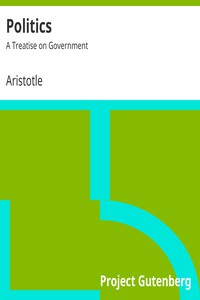

# Politics: A Treatise on Government <kbd>v2.2.1</kbd>

## Authors

 - Aristotle <small>(-384 - -322)</small>

## Translators

 - Ellis, William <small>(1730 - 1801)</small>

## Subjects

 - Political science

## Readablility

 - **A1:** 78%
 - **A2:** 84%
 - **B1:** 89%
 - **B2:** 95%
 - **C1:** 98%
 - **C2:** 100%

## Words Count

 - **A1:** 464
 - **A2:** 395
 - **B1:** 657
 - **B2:** 950
 - **C1:** 1008
 - **C2:** 550

## Source

<kbd>GUTHENBURGE:6762</kbd>
