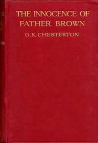

# The Innocence of Father Brown <kbd>v2.0.2</kbd>

## Authors

 - Chesterton, G. K. (Gilbert Keith) <small>(1874 - 1936)</small>

## Translators

## Subjects

 - Brown, Father (Fictitious character)
 - Catholics
 - Clergy
 - Detective and mystery stories, English
 - England

## Readablility

 - **A1:** 51%
 - **A2:** 59%
 - **B1:** 69%
 - **B2:** 84%
 - **C1:** 88%
 - **C2:** 100%

## Words Count

 - **A1:** 574
 - **A2:** 545
 - **B1:** 920
 - **B2:** 1448
 - **C1:** 648
 - **C2:** 4190

## Source

<kbd>GUTHENBURGE:204</kbd>
