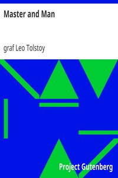

# Master and Man <kbd>v2.3.0</kbd>

## Authors

 - Tolstoy, Leo, graf <small>(1828 - 1910)</small>

## Translators

 - Maude, Aylmer <small>(1858 - 1938)</small>
 - Maude, Louise <small>(1855 - 1939)</small>

## Subjects

 - Merchants
 - Russian fiction
 - Sacrifice

## Readablility

 - **A1:** 76%
 - **A2:** 83%
 - **B1:** 89%
 - **B2:** 94%
 - **C1:** 98%
 - **C2:** 100%

## Words Count

 - **A1:** 461
 - **A2:** 327
 - **B1:** 431
 - **B2:** 560
 - **C1:** 472
 - **C2:** 197

## Source

<kbd>GUTHENBURGE:986</kbd>
