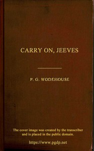

# Carry On, Jeeves <kbd>v2.2.1</kbd>

## Authors

 - Wodehouse, P. G. (Pelham Grenville) <small>(1881 - 1975)</small>

## Translators

## Subjects

 - British
 - England
 - Humorous stories
 - Jeeves (Fictitious character)
 - Short stories
 - Single men
 - Valets
 - Wooster, Bertie (Fictitious character)

## Readablility

 - **A1:** 79%
 - **A2:** 84%
 - **B1:** 89%
 - **B2:** 94%
 - **C1:** 98%
 - **C2:** 100%

## Words Count

 - **A1:** 490
 - **A2:** 461
 - **B1:** 804
 - **B2:** 1229
 - **C1:** 1242
 - **C2:** 850

## Source

<kbd>GUTHENBURGE:65974</kbd>
