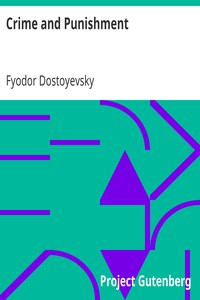

# Crime and Punishment <kbd>v2.1.0</kbd>

## Authors

 - Dostoyevsky, Fyodor <small>(1821 - 1881)</small>

## Translators

 - Garnett, Constance <small>(1861 - 1946)</small>

## Subjects

 - Crime
 - Detective and mystery stories
 - Murder
 - Psychological fiction
 - Saint Petersburg (Russia)

## Readablility

 - **A1:** 72%
 - **A2:** 77%
 - **B1:** 82%
 - **B2:** 87%
 - **C1:** 88%
 - **C2:** 100%

## Words Count

 - **A1:** 875
 - **A2:** 710
 - **B1:** 1126
 - **B2:** 1455
 - **C1:** 563
 - **C2:** 5213

## Source

<kbd>GUTHENBURGE:2554</kbd>
