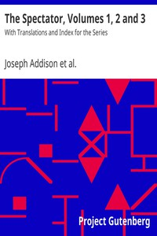

# The Spectator, Volumes 1, 2 and 3: With Translations and Index for the Series <kbd>v2.3.0</kbd>

## Authors

 - Steele, Richard, Sir <small>(1672 - 1729)</small>
 - Addison, Joseph <small>(1672 - 1719)</small>

## Translators

## Subjects

 - English essays

## Readablility

 - **A1:** 77%
 - **A2:** 82%
 - **B1:** 88%
 - **B2:** 93%
 - **C1:** 98%
 - **C2:** 100%

## Words Count

 - **A1:** 495
 - **A2:** 497
 - **B1:** 992
 - **B2:** 1907
 - **C1:** 3419
 - **C2:** 4054

## Source

<kbd>GUTHENBURGE:12030</kbd>
